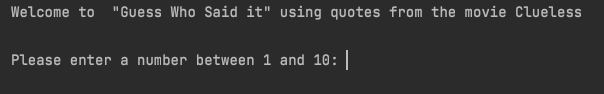
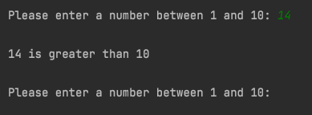
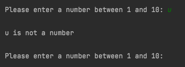
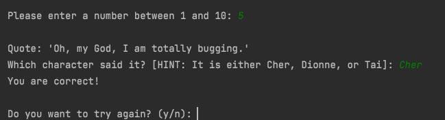
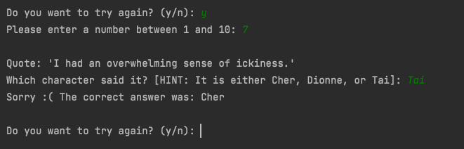
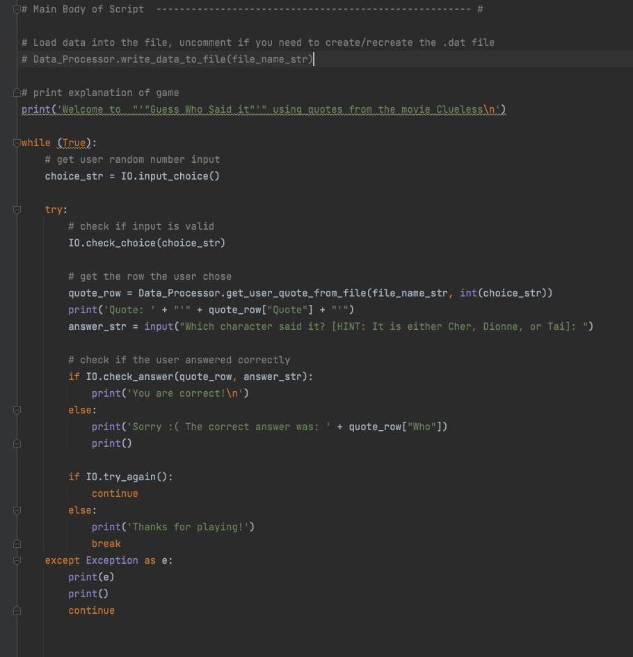
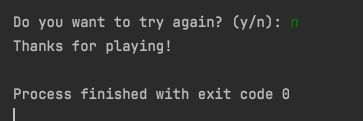

Jessica Wray

29 November 2021

Foundations of Programming, Python

Assignment 07


# Exception Handling and Pickling in Python

** **

## Introduction

This assignment deviated from the format we’ve used for past assignments. This week we were asked to research both exception handling and pickling in Python. We were then tasked with writing our own script from scratch to demonstrate and showcase what we had learned about both topics.

**Exception Handling in Python**

There is no shortage of great examples on the web that walk you through exception handling in Python. Some stick with the very basics of it and others go further in depth and talk about creating your own custom error handling and when it is appropriate to do so.

I found the “[Python Try Except](https://www.w3schools.com/python/python_try_except.asp)” article on W3 Schools to give the simplest explanation and is a great place to start if you are just beginning to play with exception handling in your scripts. I also like W3 School’s format of letting you play with the code directly from their articles. It’s an easy way to modify scripts without having to leave the web and go into your IDE to play with code.

After getting a good understanding of the basics, I moved to the post[ Exception Handling](https://medium.com/technofunnel/exception-handling-in-python-fc71497e0d18) in Python published on Medium. I liked that it starts off with a simple section on why error handling is necessary and what makes it essential to writing great code. While this article also covers the basics of exception handling using try-catch-finally, it goes further than the W3 article by explaining custom exceptions and using multiple exception clauses.

**Pickling in Python**

Pickling not as popular a topic in programming so there were not as many articles when I did a web search on it as there were for exception handling but there was still good information to be found. I found the article[ Python Pickling](https://www.tutorialspoint.com/python-pickling) on Tutorials Point to be concise and easy to digest. It also included a list of related questions and answers at the bottom that had a few more articles on pickling in case you wanted to keep exploring the concept.

For a deeper dive into pickling, I found[ What is Pickling in Python? [In-depth Guide]](https://www.afternerd.com/blog/python-pickle/) from afternerd.com to be helpful in understanding the differences to other methods of storing data that are popular in programming such as json and protocol buffers. It included a helpful table on the pros and cons of each protocol as well as explain what can and cannot be pickled.

** **

## Creating the Script

I have a hard time blindly coming up with a project to showcase certain concepts so I struggled with this. I think my background in software development is why this is so hard. I am used to solving real world problems and it’s hard to just come up with something fun. I decided to create a game that loads ten quotes from the movie “Clueless” and then asks the user to guess who said it (with some hints).

Like the previous assignment I separated my code into the three main parts: processing, input/output, and the main script. Of note is that there is a function in the processing class that will create and load the binary file but I have included the file with the code so I commented out the line in the main script that calls that. Since this is just a simple script, I only chose ten quotes to choose from so I ask the user to input a number from one to ten. I have a function that raises an exception if the user did not put in a valid input.

Once I know the input is valid, I load the binary data into a list of dictionary items so I can iterate through them and find the quote to display. The user is then prompted to guess who said the quote. There is a function to check if their answer is right and returns the appropriate string to display. It then asks the user if they want to try again with prompts to answer “y” or “n”. An exception is raised if they enter anything other than those choices. If they choose “y” it starts again, “n” exits out of the script.

You can see the main script below. 
```
# ---------------------------------------------------------------------------- #
# Title: Assignment 07
# Description: Script that showcases the concepts of exception handling and
#   pickling in Python using quotes from the movie "Clueless" and having the
#   user guess who said them
# ChangeLog (Who,When,What):
# JWray,11.27.21,Created Script
# ---------------------------------------------------------------------------- #

import pickle

# Data ---------------------------------------------------------------------- #
# Declare variables and constants
file_name_str = "AppData.dat"  # The name of the data file
file_obj = None  # An object that represents a file
choice_str = ""  # Captures the user number selection
message_str = "" # stores the message returned when checking user input
answer_str = "" # stores answer user provides after reading the quote
quote_row = {} # stores one row from the file
# A list of quotes to be loaded at the start of the script
table_lst = [{'Quote':'Ugh! As if!', 'Who':'Cher'},
             {'Quote':'Hello, that was a stop sign.', 'Who':'Dionne'},
             {'Quote':'Rollin"'" with the homies.", 'Who':'Tai'},
             {'Quote':'I don"'"t wear polyester hair, okay?", 'Who':'Dionne'},
             {'Quote':'Oh, my God, I am totally bugging.', 'Who':'Cher'},
             {'Quote':'If I"'"m to good for him, then how come I"'"m not with him?', 'Who':'Tai'},
             {'Quote':'I had an overwhelming sense of ickiness.', 'Who':'Cher'},
             {'Quote':'Murray, I have asked you repeatedly not to call me woman', 'Who':'Dionne'},
             {'Quote':'And in conclusion, may I please remind you that it does not say "'" RSVP"'" on the '
                      'Statue of Liberty.', 'Who':'Cher'},
             {'Quote':'I"'"m not a prude, I"'"m just highly selective.', 'Who':'Cher'}]

# Processing  --------------------------------------------------------------- #
class Data_Processor:
    """  Performs Processing tasks """

    @staticmethod
    def write_data_to_file(file_name):
        """ Writes data to a binary file

               :param file_name: (string) name of file to write to
               :return: none
               """
        file = open(file_name, 'wb')
        pickle.dump(table_lst, file)
        file.close()
        return

    @staticmethod
    def get_user_quote_from_file(file_name, choice):
        """ Returns quote user choice from file

                       :param: file_name: (string) name of file to read from
                       :param: choice: (int) quote number to return
                       :return: quote_row: (dictionary) quote for user to guess from
                       """

        file = open(file_name, 'rb')

        quotes = pickle.load(file)
        quote_row = {}
        counter = 1

        # loop through the rows to get the one the user chose
        for row in quotes:
            if counter == choice:
                quote_row = row
                break
            else:
                counter = counter + 1
                continue

        return quote_row


# Presentation (Input/Output)  -------------------------------------------- #

class IO:
    """  Performs input/output tasks  """

    @staticmethod
    def input_choice():
        """ Gets the quote choice from a user

           :return: string
           """
        choice = str(input('Please enter a number between 1 and 10: ').strip())
        print()  # Add an extra line for looks

        return choice

    @staticmethod
    def check_choice(choice):
        """ Checks to ensure user input a valid choice before processing and raises an exception if not

                :param: choice: (string) input from user
                :return: none
                """
        if choice.isnumeric():
            if int(choice) > 10:
                # message = str(choice) + ' is greater than 10'
                raise Exception(str(choice) + ' is greater than 10')
        else:
            # message = str(choice) + ' is not a number'
            raise Exception(str(choice) + ' is not a number')

    @staticmethod
    def check_answer(row, answer):
        """ Checks if user guess is correct

                :param: row: (dict) row from user choice
                :param: answer: (string) input from user
                :return: message: (bool) tells whether user was right or not
                """
        if row["Who"].lower() == answer.lower():
            message = True
        else:
            message = False

        return message

    @staticmethod
    def try_again():
        """ Checks if user wants to keep playing

               :param: none
               :return: (bool)
               """
        choice = input('Do you want to try again? (y/n): ')

        if choice.lower() == 'y' or choice.lower() == 'n':
            if choice.lower() =='y':
                return True
            else:
                return False
        else:
            raise Exception('please enter a y or n')

# Main Body of Script  ------------------------------------------------------ #

# Load data into the file, uncomment if you need to create/recreate the .dat file
# Data_Processor.write_data_to_file(file_name_str)

# print explanation of game
print('Welcome to  "'"Guess Who Said it"'" using quotes from the movie Clueless\n')

while (True):
    # get user random number input
    choice_str = IO.input_choice()

    try:
        # check if input is valid
        IO.check_choice(choice_str)

        # get the row the user chose
        quote_row = Data_Processor.get_user_quote_from_file(file_name_str, int(choice_str))
        print('Quote: ' + "'" + quote_row["Quote"] + "'")
        answer_str = input("Which character said it? [HINT: It is either Cher, Dionne, or Tai]: ")

        # check if the user answered correctly
        if IO.check_answer(quote_row, answer_str):
            print('You are correct!\n')
        else:
            print('Sorry :( The correct answer was: ' + quote_row["Who"])
            print()

        if IO.try_again():
            continue
        else:
            print('Thanks for playing!')
            break
    except Exception as e:
        print(e)
        print()
        continue
```

## Running the Script

To run the script in PyCharm I right clicked and chose “Run” from the dropdown menu. You can see the initial screen below.



I then tested the exception handling by entering both a number outside of the range as well as a non-numeric character. You can see the error messages in the figures below.





After verifying that the exception handling executed as expected, I started to play the game. I first tried one where I got the answer correct as seen below.



I wanted to make sure that inputting the wrong answer would run as expected. I choose “y” to keep going and then input the wrong answer. The script gave the correct response as seen below.



Finally, I exited out of the script and was done with the game.



Finally, I ran the script in a terminal window to verify that the script executed as expected. You can see the results below.



## Conclusion

As mentioned at the start, this was a hard assignment for me. I understand the concepts but coming up with my own program with zero direction is not something I am very good at. I feel very strong in my abilities to read and write to a file using Python but I’m hoping we get some more chances to work with exception handling as I don’t feel as confident in that area.
